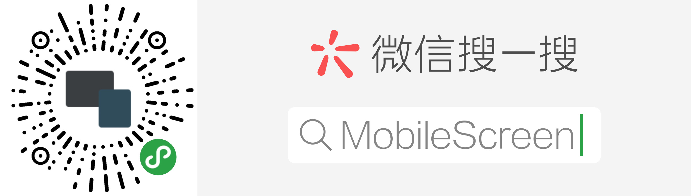
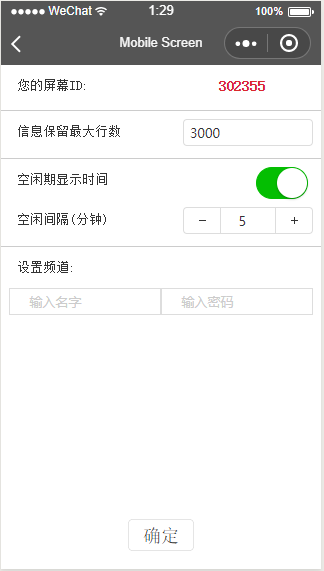
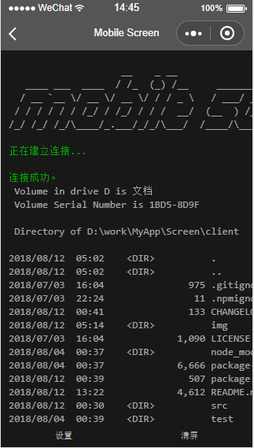

# mobile-screen

mobile-screen可以通过网络把你的电脑命令行的输出信息推送到移动设备的显示屏上。

本功能目前依赖微信小程序MobileScreen的配合。

# 安装

mobile-scren依赖node.js，请自行安装好node.js，这里是官网 https://nodejs.org 。

假设您已经安装好了node.js，那么请在windows系统下打开cmd.exe或者在linux系统的终端执行：

`
npm install mobile-screen -g
`

npm是node.js的包管理器，-g 参数意味着我们全局安装mobile-screen, 带来的好处是我们可以直接在任何命令行窗口中使用“mscreen”命令，比如可以查看mobile-screen的版本：

`
mscreen -V
`

查看帮助

`
mscreen -h
`

# 配置

请在微信界面搜索小程序:MobileScreen，或用微信扫描二维码：

打开后，点击下方的设置按钮,进入设置页面：

其中红色字体是你的screenID，每个人都不一样，为了下面解释方便，我们假设你得到的screen ID为:302355。

你唯一需要做的是填写一个频道用户名和密码，这样只有知晓这些信息的用户被允许推送信息到你的小程序上。假设你已经设置用户名为：user1，密码为:123456。

设置好后，微信小程序MobileScreen会连接好服务器，此时手机屏幕将自动处于常亮状态。

# 使用

mobile-screen的主要任务是承接其它命令行的输出，并把信息通过网络传送到微信小程序MobileScreen上，一般不会单独使用。

回到电脑终端的命令行操作界面，执行：

`
dir | mscreen -s 302355 -u user1 -p 123456
`

几乎实时地，你会在手机微信小程序mobile-screen的屏幕上看到当前目录输出信息：

重点解释一下这句命令，其实它串联执行了两个命令，两个命令用了|分割，|之前的命令是你要执行的任何其它命令行程序，示例用的是DOS的dir命令，如果是linux你可以用ls命令，总之这个命令可以是任何你需要执行的命令行工具。

而|之后的命令就是我们的mobile-screen了，|的作用就是把前一个命令的输出转移到后面的程序，相信程序员都知道，这是一个标准的管道连接符。

可以看到mscreen命令用了三个选项，分别是：-s ，-u和-p，它们分别指定我们刚才获得的screen ID，用户名和用户密码。

每次都要这么输入似乎有点麻烦，你可以执行：

`命令
mscreen config  -s 123456 -u user1 -p abc
`
这样就把screen ID，用户名和密码就暂存到了一个配置文件里（注意，这里的具体screen ID和用户名及密码不是真实数据，需要你自己根据前面的步骤获取），下次你再执行时就可以这么用：

`命令
dir | mcreen
`
效果是一样的，但用起来简单了很多，现在，你执行的任何命令后面只要添加"| screen"就可以把信息输出到手机屏幕上了。当然，你可以随时在命令中改变其中一些参数，它会比配置文件里的参数优先适用。

# 案例

有很多命令行工具都可以和mobile-screen配合使用，这完全取决于你的需求。

* 在手机上阅读文档

长时间坐着阅读文档会比较累，此时你可以把要阅读的文档推送到手机或平板上.
`命令
    type yourDoc.file | mscrenn
`
yourDoc.file是你要阅读的文件，type是windows系统自带命令，如果是linux可以用cat命令代替。

* 聊天协作

如果同事之间知道彼此的频道信息，可以相互直发信息，交流代码配置，并且是真正的阅后即焚。

`命令
    echo 美女，帮我看一下我的webpack.config.js对不对? | mscreen -s 123123 -u user1 -p 2312
`

为了大家能共享一些有趣的命令行工具，另开了一个项目：https://github.com/hongbing2017/javis ,方便大家能快速简单的执行各种任务。比如，相同的功能在不同操作系统下有不同的命令或安装方式，Javis可以帮助用户忽略这些差异。

欢迎大家能把自己觉得好的应用方案提交到贾维斯了，同时请关注公众号：MobileScreen, 这样如果Javis有了更新，你可以得到一些新玩法的推送。

最后要说的是，本项目目前处于试用状态，没有任何保证，由于服务器很小，你可能会遇到连接不上情况，我们将尽力改善用户体验。